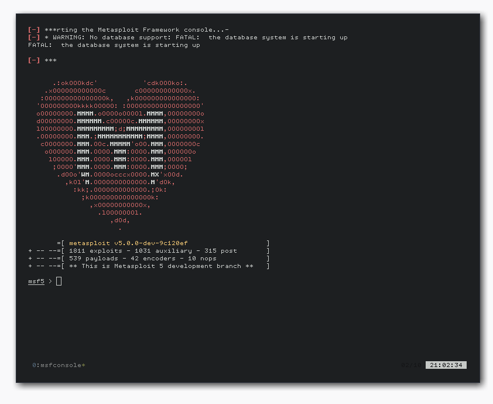

# Metasploit docker container
[](https://hub.docker.com/r/strm/metasploit/)


Metasploit is a penetration testing platform that enables you to find, exploit,
and validate vulnerabilities. This image contains the base metasploit install
along with some useful tools like nmap and tor.

# Run

To run it just install docker and run

```
docker run --rm -it \
       -p 4444:4444 -p 80:80 -p 8080:8080 \
       -p 443:443 -p 445:445 -p 8081:8081 \
       strm/metasploit
```

Then it will run all services (tor and postgres) and start a *tmux* session




Last update: Tue Oct  2 13:56:39 UTC 2018

